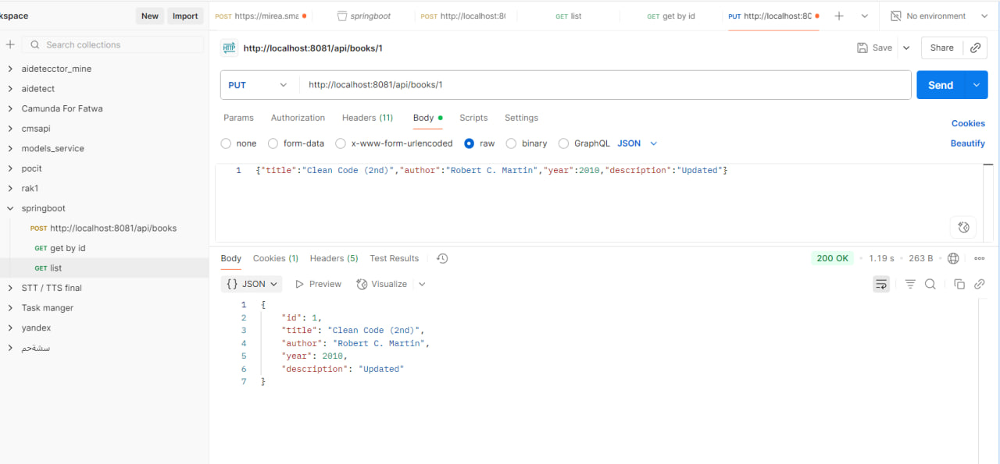

# 📚 Spring Boot Books API

---

## CRUD Operations

### CREATE Operations

**POST /api/books** | Create Book | **201 Created**

---

**POST /api/books** | Create Book | **400 Bad Request**

---

### READ Operations

**GET /api/books** | List All Books | **200 OK**

---

**GET /api/books/{id}** | Get Book by ID | **200 OK**

---

**GET /api/books/{id}** | Get Book by ID | **404 Not Found**

---

### UPDATE Operations

**PUT /api/books/{id}** | Update Book | **200 OK**

---

### DELETE Operations

**DELETE /api/books/{id}** | Delete Book | **204 No Content**

---
